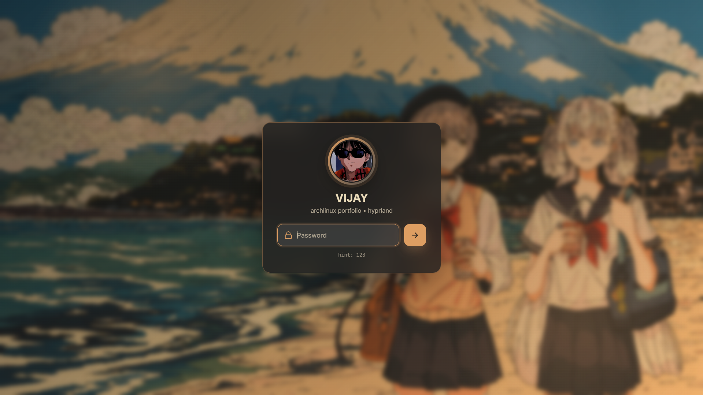
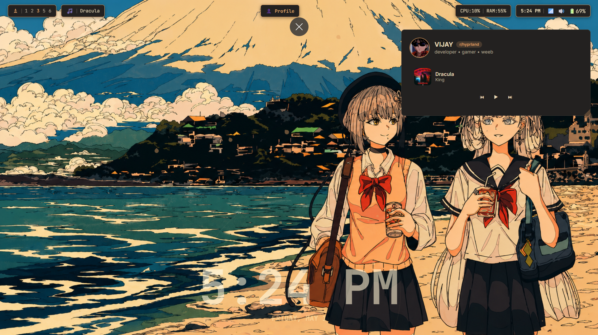
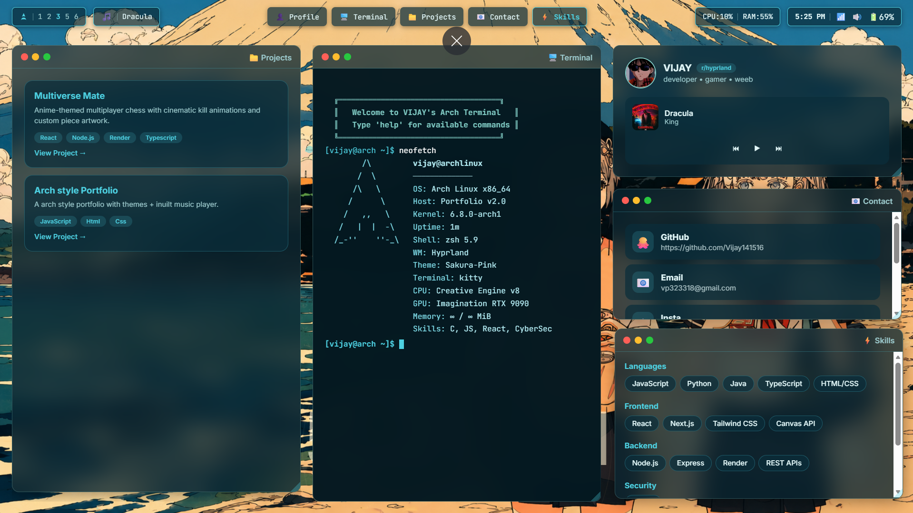
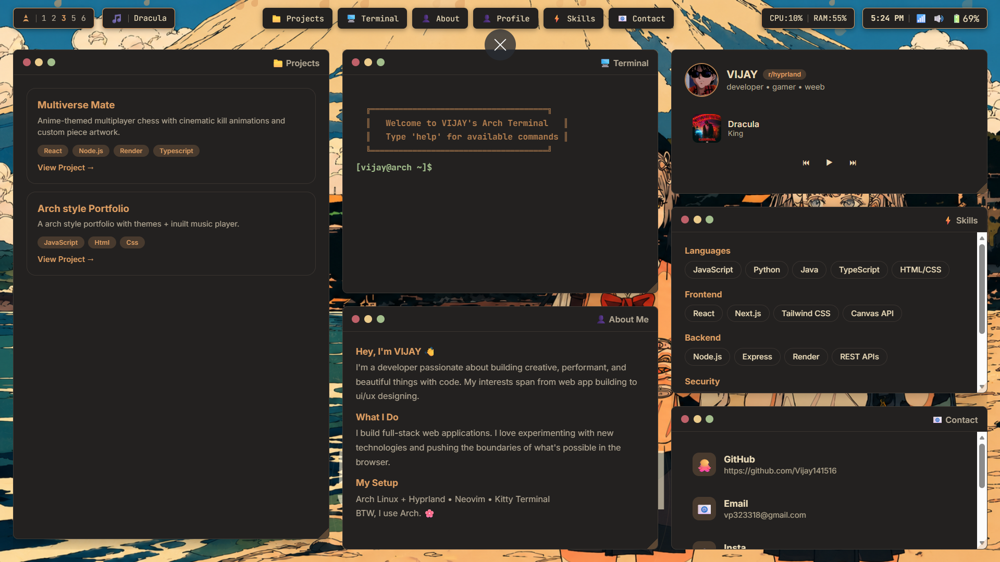

<p align="center">     </p> <p align="center"> 💻 A **fully interactive Linux-inspired portfolio** with tiling windows, terminal, and anime aesthetics. </p>

## 🌐 Live Demo  

👉 **Try it here:**  
🔗 https://vijay141516.github.io/Arch-linux-style-portfolio/

---

## ✨ Features  

- 🪟 **Tiling Window Manager** — Real desktop-like window system  
- 📟 **Terminal Emulator** — Interactive Linux-style terminal  
- 🎵 **Music Player** — Built-in background player  
- ⚙️ **Settings Panel** — Blur, transparency, theme toggle  
- 📱 **Mobile Optimization** — Custom navbar + responsive UI  
- 🎨 **Aesthetic UI** — Arch Linux + Hyprland inspired design  

---

## 🛠️ Tech Stack  

- **HTML5** → Structure  
- **CSS3** → Animations + Glass UI + Layout  
- **JavaScript** → Logic + Window Manager + Terminal  

---

## 🚀 Getting Started  

### 📥 Clone Repo  

```bash
git clone https://github.com/Vijay141516/Arch-linux-style-portfolio.git
cd Arch-linux-style-portfolio
```

### ▶️ Run  

```bash
open index.html
```

---

## 📸 Screenshots  






---

## 🤝 Contributing  

Want to improve it?  

- Fork repo  
- Create branch  
- Make changes  
- Submit PR 🚀  

---

## 📄 License  

MIT License — free to use & modify  

---

## 👨‍💻 Author  

**Vijay**  
🔗 https://github.com/Vijay141516  

---

## ⭐ Final Touch  

If you like this project:  

👉 Drop a ⭐ on GitHub  
👉 Share with dev friends  
👉 Use it as your portfolio base  
